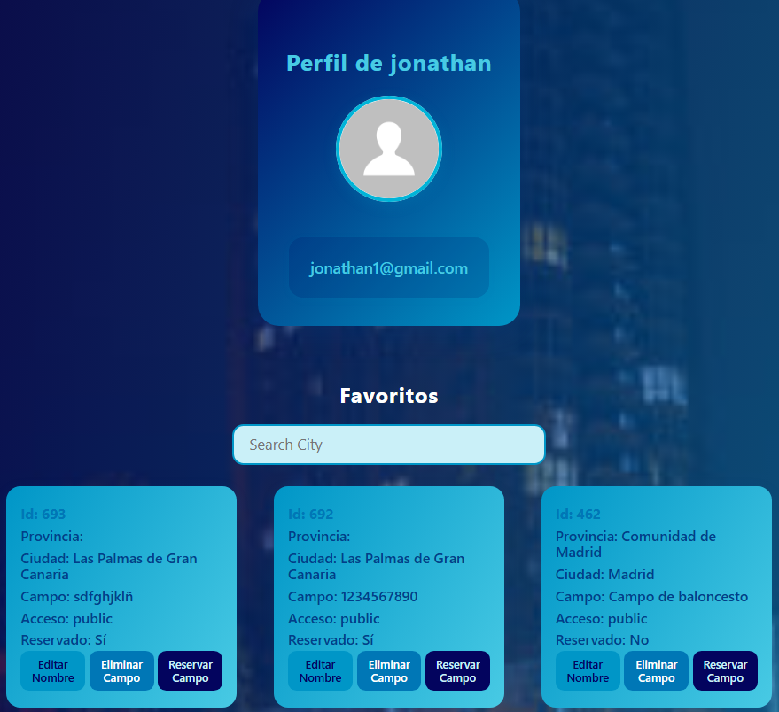
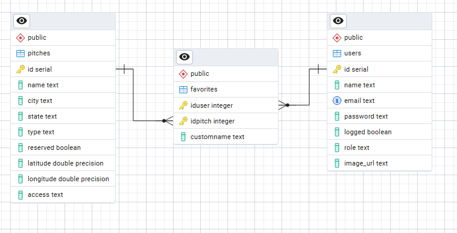

# 🏀 Ringtomic

**Ringtomic** es desarrollo web **fullstack** pensada para facilitar la **reserva de pistas de baloncesto** y organizar partidos junto a tus amigos y desconocidos, ya sea en canchas publicas o privadas.

### 🧩 Funcionalidades actuales:
- Registro de usuarios
- Visualización de canchas en un mapa interactivo
- Posibilidad de añadir canchas a favoritos

---

## 🖥️ Frontend

- Construido con **React JS** usando **Vite** para una configuración rápida y moderna.
- Estilos implementados con **SASS**.
- Incluye **3 pequeños tests** para componentes clave.
- Para más detalles, consulta el [README del Frontend](./client/README.md).

<p align="center">
  
  
</p>

---

## ⚙️ Backend

- Desarrollado con **Express.js**.
- Utiliza una base de datos **PostgreSQL** con tres tablas principales:
  - `Users`
  - `Pitches`
  - `Favorites`

📸 **Diagrama E-R:**

<p align="center">
  
</p>

🔗 **Documentación Swagger**:  
👉 [https://ringtomic.onrender.com/api-swagger/](https://ringtomic.onrender.com/api-swagger/)

📄 Para más detalles sobre la configuración del backend, revisa el [README del Backend](./server/README.md)

## 🌐 Enlaces de despliegue

- 🔵 **Frontend (Netlify)**: [https://ringtomic.netlify.app/login](https://ringtomic.netlify.app/login)
- 🟡 **Backend (Render)**: [https://ringtomic.onrender.com/ready](https://ringtomic.onrender.com/ready)

> ⏳ **Nota:** El backend está desplegado en **Render**, un servicio gratuito que entra en modo de suspensión tras un período de inactividad.  
> Por eso, **puede tardar unos segundos en responder la primera vez** que accedas desde el frontend.


---

## 🐳 Instrucciones para levantar Ringtomic con Docker Compose

1. Clona el repositorio:
   ```sh
   git clone https://github.com/jonha20/ringtomic.git
   cd ringtomic
   mv .env.example .env
   docker-compose up --build

## ⏱️ Nota sobre el desarrollo

Este proyecto fue desarrollado en el plazo de **una semana**, por lo que algunas funcionalidades o detalles visuales pueden no estar completamente pulidos.  
El objetivo principal fue aprender y poner en práctica tecnologías **fullstack** modernas de forma intensiva.
